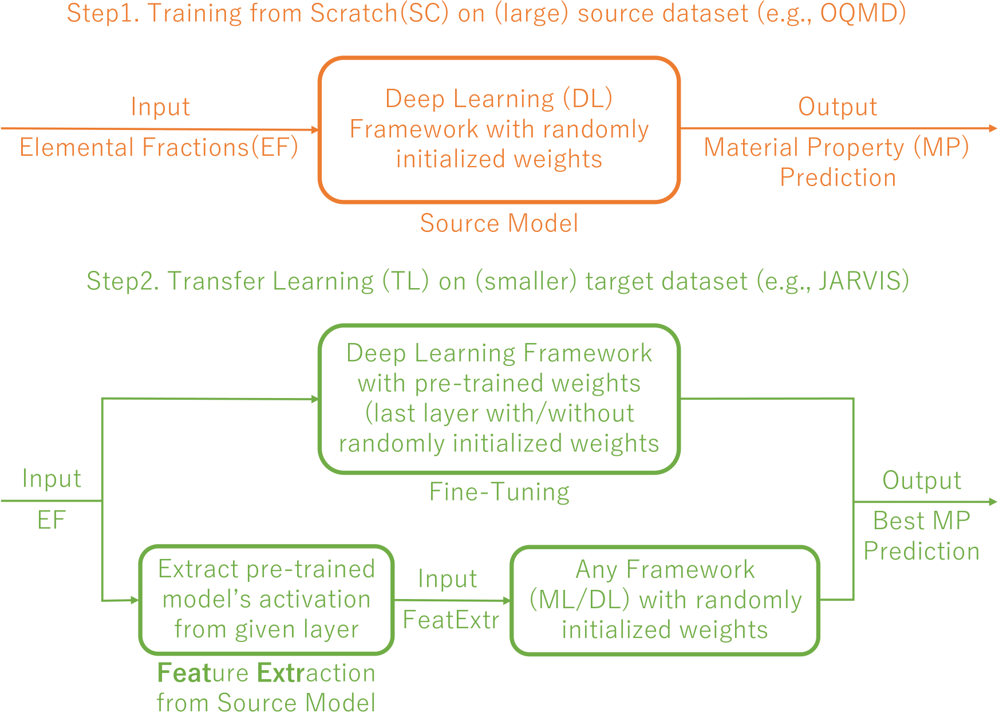

# ElemNet-TF2

This repository contains the code for performing activation extraction and model training along with various models trained on different materials property using Elemental Fraction (EF) as the model input. It is recommended to train large dataset (e.g. OQMD, MP) from scratch (SC) and small datasets (DFT-computed or experimental datasets) using transfer learning methods shown below:

  

## Installation Requirements

The basic requirement for using the files are a Python 3.6.3 Jupyter environment with the packages listed in `requirements.txt`.

## Source Files

The code for training the ElemNet-TF2 model along with the various trained models produced in our work [1] are available in the [`elemnet` folder](./elemnet).
  
Here is a brief explanation about the folder content:

* [`elemnet`](./elemnet): code for training the ElemNet-TF2 model from scratch or using transfer learning from a pretrained model [1], along with making predictions on test set seperately using a trained model.

* [`data`](./data): the datasets used for training ElemNet-TF2 model in [1].

* [`activation`](./activation): Jupyter Notebook to extract activations from each layer of pre-trained model trained on ElemNet-TF2.

* [`prediction`](./prediction): Jupyter Notebook for performing model testing for ElemNet-TF2 model.

## Running the code

The code to run the ElemNet-TF2 model is provided inside the [`elemnet`](./elemnet) folder. Inside the folder, you can run the model by passing a sample config file to the dl_regressors_tf2.py as follows:

`python dl_regressors_tf2.py --config_file sample/sample-run_example_tf2.config`

The config file defines all the related hyperparameters associated with the model training and model testing such as loss_type, training_data_path, test_data_path, label, input_type [elements_tl for ElemNet] etc. For transfer learning, you need to set 'model_path' [e.g. `model/sample_model`]. The output log
from will be shown in the [`log`] folder as `log/sample.log` file. The trained model will be saved in [`data`](./model) folder.

## Developer Team

The code was developed by Vishu Gupta from the <a href="http://cucis.ece.northwestern.edu/">CUCIS</a> group at the Electrical and Computer Engineering Department at Northwestern University.

## Publications

Please cite the following works if you are using ElemNet model:

1. Vishu Gupta, Kamal Choudhary, Francesca Tavazza, Carelyn Campbell, Wei-keng Liao, Alok Choudhary, and Ankit Agrawal, “Cross-property deep transfer learning framework for enhanced predictive analytics on small materials data,”.

## Questions/Comments

email: vishugupts2020@u.northwestern.edu or ankitag@eecs.northwestern.edu 
Copyright (C) 2021, Northwestern University. 
See COPYRIGHT notice in top-level directory.

## Funding Support

This work was performed under the following financial assistance award 70NANB19H005 from U.S. Department of Commerce, National Institute of Standards and Technology as part of the Center for Hierarchical Materials Design (CHiMaD). Partial support is also acknowledged from DOE awards DE-SC0014330, DE-SC0019358.
